```mermaid
flowchart TB
    subgraph current["SlurperDemo.Web.csproj"]
        MAIN["<b>📦&nbsp;SlurperDemo.Web.csproj</b><br/><small>net9.0</small>"]
        click MAIN "#slurperdemowebslurperdemowebcsproj"
    end
    subgraph downstream["Dependencies (1"]
        P1["<b>📦&nbsp;WebSpark.Slurper.csproj</b><br/><small>net8.0;net9.0</small>"]
        click P1 "#websparkslurperwebsparkslurpercsproj"
    end
    MAIN --> P1

```

```mermaid
flowchart TB
    subgraph current["WebSpark.Slurper.Tests.csproj"]
        MAIN["<b>📦&nbsp;WebSpark.Slurper.Tests.csproj</b><br/><small>net9.0</small>"]
        click MAIN "#websparkslurpertestswebsparkslurpertestscsproj"
    end
    subgraph downstream["Dependencies (1"]
        P1["<b>📦&nbsp;WebSpark.Slurper.csproj</b><br/><small>net8.0;net9.0</small>"]
        click P1 "#websparkslurperwebsparkslurpercsproj"
    end
    MAIN --> P1

```

```mermaid
flowchart TB
    subgraph upstream["Dependants (2)"]
        P2["<b>📦&nbsp;WebSpark.Slurper.Tests.csproj</b><br/><small>net9.0</small>"]
        P3["<b>📦&nbsp;SlurperDemo.Web.csproj</b><br/><small>net9.0</small>"]
        click P2 "#websparkslurpertestswebsparkslurpertestscsproj"
        click P3 "#slurperdemowebslurperdemowebcsproj"
    end
    subgraph current["WebSpark.Slurper.csproj"]
        MAIN["<b>📦&nbsp;WebSpark.Slurper.csproj</b><br/><small>net8.0;net9.0</small>"]
        click MAIN "#websparkslurperwebsparkslurpercsproj"
    end
    P2 --> MAIN
    P3 --> MAIN

```

# Projects and dependencies analysis

This document provides a comprehensive overview of the projects and their dependencies in the context of upgrading to .NET 9.0.

## Table of Contents

- [Projects Relationship Graph](#projects-relationship-graph)
- [Project Details](#project-details)

  - [SlurperDemo.Web\SlurperDemo.Web.csproj](#slurperdemowebslurperdemowebcsproj)
  - [WebSpark.Slurper.Tests\WebSpark.Slurper.Tests.csproj](#websparkslurpertestswebsparkslurpertestscsproj)
  - [WebSpark.Slurper\WebSpark.Slurper.csproj](#websparkslurperwebsparkslurpercsproj)
- [Aggregate NuGet packages details](#aggregate-nuget-packages-details)

## Projects Relationship Graph

Legend:
📦 SDK-style project
⚙️ Classic project

```mermaid
flowchart LR
    P1["<b>📦&nbsp;WebSpark.Slurper.csproj</b><br/><small>net8.0;net9.0</small>"]
    P2["<b>📦&nbsp;WebSpark.Slurper.Tests.csproj</b><br/><small>net9.0</small>"]
    P3["<b>📦&nbsp;SlurperDemo.Web.csproj</b><br/><small>net9.0</small>"]
    P2 --> P1
    P3 --> P1
    click P1 "#websparkslurperwebsparkslurpercsproj"
    click P2 "#websparkslurpertestswebsparkslurpertestscsproj"
    click P3 "#slurperdemowebslurperdemowebcsproj"

```

## Project Details

### SlurperDemo.Web\SlurperDemo.Web.csproj

#### Project Info

- **Current Target Framework:** net9.0
- **Proposed Target Framework:** net10.0
- **SDK-style**: True
- **Project Kind:** AspNetCore
- **Dependencies**: 1
- **Dependants**: 0
- **Number of Files**: 36
- **Lines of Code**: 3036

#### Dependency Graph

Legend:
📦 SDK-style project
⚙️ Classic project

#### Project Package References

| Package | Type | Current Version | Suggested Version | Description |
| :--- | :---: | :---: | :---: | :--- |

### WebSpark.Slurper.Tests\WebSpark.Slurper.Tests.csproj

#### Project Info

- **Current Target Framework:** net9.0
- **Proposed Target Framework:** net10.0
- **SDK-style**: True
- **Project Kind:** DotNetCoreApp
- **Dependencies**: 1
- **Dependants**: 0
- **Number of Files**: 7
- **Lines of Code**: 2020

#### Dependency Graph

Legend:
📦 SDK-style project
⚙️ Classic project

#### Project Package References

| Package | Type | Current Version | Suggested Version | Description |
| :--- | :---: | :---: | :---: | :--- |
| Microsoft.NET.Test.Sdk | Explicit | 18.0.0 |  | ✅Compatible |
| xunit | Explicit | 2.9.3 |  | ✅Compatible |
| xunit.runner.visualstudio | Explicit | 3.1.5 |  | ✅Compatible |
| Xunit.SkippableFact | Explicit | 1.5.23 |  | ✅Compatible |

### WebSpark.Slurper\WebSpark.Slurper.csproj

#### Project Info

- **Current Target Framework:** net8.0;net9.0
- **Proposed Target Framework:** net8.0;net9.0;net10.0
- **SDK-style**: True
- **Project Kind:** ClassLibrary
- **Dependencies**: 0
- **Dependants**: 2
- **Number of Files**: 24
- **Lines of Code**: 3425

#### Dependency Graph

Legend:
📦 SDK-style project
⚙️ Classic project

#### Project Package References

| Package | Type | Current Version | Suggested Version | Description |
| :--- | :---: | :---: | :---: | :--- |
| Microsoft.CSharp | Explicit | 4.7.0 |  | ✅Compatible |
| Microsoft.Extensions.Configuration.UserSecrets | Explicit | 9.0.9 | 10.0.0 | NuGet package upgrade is recommended |
| Microsoft.Extensions.DependencyInjection | Explicit | 9.0.9 | 10.0.0 | NuGet package upgrade is recommended |
| Microsoft.Extensions.Http | Explicit | 9.0.9 | 10.0.0 | NuGet package upgrade is recommended |
| Microsoft.Extensions.Logging | Explicit | 9.0.9 | 10.0.0 | NuGet package upgrade is recommended |
| Microsoft.Extensions.Logging.Abstractions | Explicit | 9.0.9 | 10.0.0 | NuGet package upgrade is recommended |
| Microsoft.SourceLink.GitHub | Explicit | 8.0.0 |  | ✅Compatible |
| System.Text.Json | Explicit | 9.0.9 | 10.0.0 | NuGet package upgrade is recommended |

## Aggregate NuGet packages details

| Package | Current Version | Suggested Version | Projects | Description |
| :--- | :---: | :---: | :--- | :--- |
| Microsoft.CSharp | 4.7.0 |  | [WebSpark.Slurper.csproj](#websparkslurpercsproj) | ✅Compatible |
| Microsoft.Extensions.Configuration.UserSecrets | 9.0.9 | 10.0.0 | [WebSpark.Slurper.csproj](#websparkslurpercsproj) | NuGet package upgrade is recommended |
| Microsoft.Extensions.DependencyInjection | 9.0.9 | 10.0.0 | [WebSpark.Slurper.csproj](#websparkslurpercsproj) | NuGet package upgrade is recommended |
| Microsoft.Extensions.Http | 9.0.9 | 10.0.0 | [WebSpark.Slurper.csproj](#websparkslurpercsproj) | NuGet package upgrade is recommended |
| Microsoft.Extensions.Logging | 9.0.9 | 10.0.0 | [WebSpark.Slurper.csproj](#websparkslurpercsproj) | NuGet package upgrade is recommended |
| Microsoft.Extensions.Logging.Abstractions | 9.0.9 | 10.0.0 | [WebSpark.Slurper.csproj](#websparkslurpercsproj) | NuGet package upgrade is recommended |
| Microsoft.NET.Test.Sdk | 18.0.0 |  | [WebSpark.Slurper.Tests.csproj](#websparkslurpertestscsproj) | ✅Compatible |
| Microsoft.SourceLink.GitHub | 8.0.0 |  | [WebSpark.Slurper.csproj](#websparkslurpercsproj) | ✅Compatible |
| System.Text.Json | 9.0.9 | 10.0.0 | [WebSpark.Slurper.csproj](#websparkslurpercsproj) | NuGet package upgrade is recommended |
| xunit | 2.9.3 |  | [WebSpark.Slurper.Tests.csproj](#websparkslurpertestscsproj) | ✅Compatible |
| xunit.runner.visualstudio | 3.1.5 |  | [WebSpark.Slurper.Tests.csproj](#websparkslurpertestscsproj) | ✅Compatible |
| Xunit.SkippableFact | 1.5.23 |  | [WebSpark.Slurper.Tests.csproj](#websparkslurpertestscsproj) | ✅Compatible |

